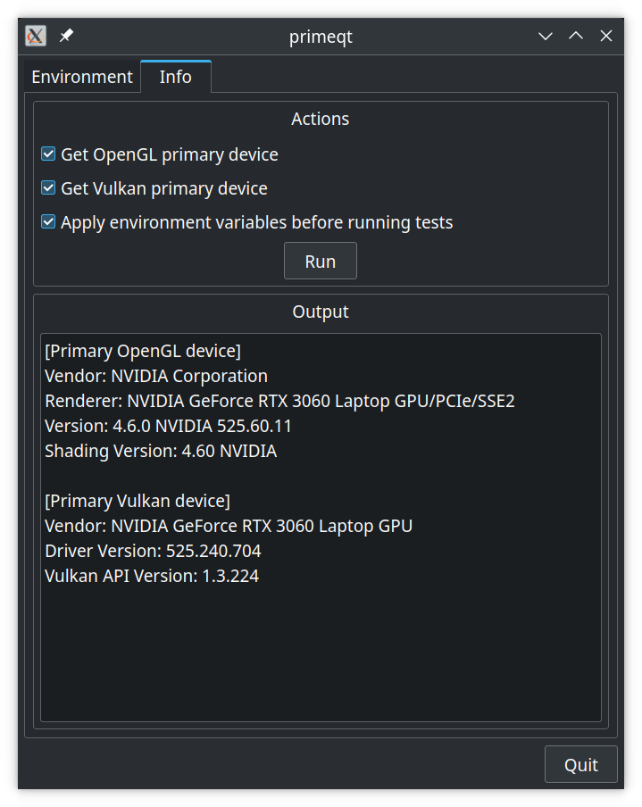

# prime
tool to help run on nvidia dgpus in laptops on linux

## Requirements

to compile this you need Qt5, vulkan, opengl, glew, glfw3.3 or higher.

## Configuration

prime reads ~/.config/prime/prime.cfg for setting environment variables with the syntax `envvar=value` , one var per line.
check the prime.cfg.example or create a template with the `primeqt` gui.




## Usage

```bash
usage: prime <command>

example:
  prime glxgears    will run glxgears with set environment variables from ~/.config/prime/prime.cfg

```

## Contributing
Pull requests are welcome. bug reports aswell :)
